<div align="center">

# 👋 Merhaba, Ben Tuğrahan!

### 🎓 Marmara Üniversitesi - Bilgisayar Mühendisliği Mezunu
### 💼 Software Developer


</div>

---

## 🚀 Hakkımda

```python
class SoftwareDeveloper:
    def __init__(self):
        self.name = "Tuğrahan"
        self.education = "Marmara Üniversitesi - Bilgisayar Mühendisliği"
        self.role = "Software Developer"
        self.interests = ["Backend Development", "AI/ML", "Database Design"]
        self.currently_learning = ["Advanced AI", "Cloud Architecture"]

    def say_hi(self):
        print("Projelerime göz atmayı unutma! 🚀")

me = SoftwareDeveloper()
me.say_hi()
```

---

## 🛠️ Teknoloji Yığınım

### 💻 Programlama Dilleri
<p align="center">
  
  
  
  
  
</p>

### 🎯 Backend & Framework
<p align="center">
  
  
  
  
  
</p>

### 🗄️ Veritabanları
<p align="center">
  
  
  
  
  
</p>

### 🤖 Yapay Zeka & ML
<p align="center">
  
  
  
  
  
</p>

### 🔧 Araçlar & Diğer
<p align="center">
  
  
  
  
  
</p>

---

## 📊 GitHub İstatistiklerim

<div align="center">
  
  
</div>

<div align="center">
  
</div>

---

## 🏆 GitHub Trophies

<div align="center">
  
</div>

---

## 💡 Odak Alanlarım

```mermaid
mindmap
  root((Tuğrahan))
    Backend Development
      ASP.NET Core
      Node.js
      RESTful APIs
      Microservices
    Databases
      SQL Server
      PostgreSQL
      MongoDB
      Redis
    AI & Machine Learning
      PyTorch
      Computer Vision
      NLP
      Model Fine-tuning
    DevOps
      Docker
      CI/CD
      Git
```



---

## 📫 Benimle İletişime Geçin

<p align="center">
  <a href="https://linkedin.com/in/PROFIL_ADIN">
    
  </a>
  <a href="mailto:EMAIL_ADRESIN">
    
  </a>
  <a href="https://github.com/KULLANICI_ADIN">
    
  </a>
</p>

---

<div align="center">
  
</div>

<div align="center">
  
</div>

---

<h3 align="center">⭐ Projelerimi beğendiysen yıldız vermeyi unutma! ⭐</h3>
